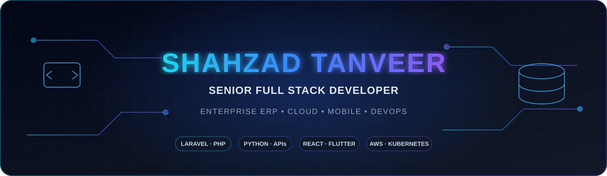

  

<h1 align="center">Shahzad Tanveer</h1>

  <strong>Senior Full-Stack, ERP, Cloud &amp; Mobile Solutions Engineer</strong> 
  Enterprise SaaS · Laravel · React · Flutter · React Native · Android · REST APIs · PostgreSQL · AWS · Docker · Linux

  
  
  

  
  
  

## Engineering Business-Critical Software

I am a Doha-based senior software engineer with **9+ years of experience** designing, building, deploying, and supporting enterprise applications. My work spans **19 ERP systems**, supports **500+ users**, and serves business operations across **eight countries**.

I specialize in turning complex recruitment, HR, finance, CRM, inventory, and operational processes into secure, maintainable software. My responsibilities cover the complete delivery lifecycle: requirements, architecture, database design, APIs, web and mobile applications, deployment, performance, security, backups, and production support.

## Professional Impact

| Impact | Evidence |
|---|---|
| **19 ERP systems** | Enterprise platforms and connected business workflows |
| **500+ users** | Recruitment, HR, finance, operations, and management teams |
| **Eight countries** | Multi-country processes, localization, integrations, and reporting |
| **9+ years** | Architecture, engineering, deployment, optimization, and support |
| **English and Arabic** | LTR/RTL web and mobile application experiences |

## Core Engineering Strengths

- **Enterprise applications:** ERP, CRM, HRM, recruitment, accounting, inventory, approvals, reporting, and audit trails
- **Backend engineering:** PHP, Laravel, REST APIs, webhooks, authentication, RBAC, queues, scheduling, and integrations
- **Frontend engineering:** React, Vue, JavaScript, Bootstrap, responsive dashboards, and bilingual interfaces
- **Mobile integration:** React Native, Flutter, Android, authentication, notifications, media, payments, and location services
- **Data engineering:** MySQL, PostgreSQL, MongoDB, schema design, migrations, reporting, and query optimization
- **Cloud and operations:** AWS, Linux, AlmaLinux, Docker, Nginx, SSL, CI/CD, monitoring, backups, and security hardening

## Technology Stack

  

  

  

## Featured Public Portfolio

### [GulfLedger](https://github.com/Development-Hubs/gulfledger) — Flagship GCC FinTech Architecture

A production-minded, multi-tenant accounting, finance, billing, and e-invoicing-readiness SaaS portfolio platform designed for GCC business requirements.

**Current portfolio status:** Phase 0 product and architecture foundation, with the requirements, architecture decisions, ERD, accounting invariants, tenant-isolation model, OpenAPI conventions, Docker-based infrastructure, governance templates, and automated foundation validation established.

**Target engineering stack:** Laravel 12 · PHP 8.4 · PostgreSQL RLS · Redis · React · TypeScript · React Native · OpenAPI 3.1 · Docker · Nginx · GitHub Actions · Terraform-ready AWS

**Engineering depth demonstrated:**

- Strict multi-tenant isolation through application policy, PostgreSQL row-level security, and composite ownership
- Double-entry accounting invariants, immutable posted journals, reversals, idempotent posting, and fiscal-period controls
- Versioned API contracts, architecture decision records, threat-model foundations, and acceptance criteria
- AWS deployment design covering ECS/Fargate, RDS, ElastiCache, S3, Secrets Manager, CloudWatch, and WAF
- Bilingual English/Arabic product direction with safe fictional data and non-production integrations

> GulfLedger is an independent engineering portfolio project. It does not claim approval or certification from any tax authority, government, Peppol, ZATCA, UAE MoF/FTA, or Qatar authority.

---

### [Enterprise Content Platform](https://github.com/Development-Hubs/laravel-content-management-assignment) — Completed Full-Stack Platform

A complete bilingual content-management platform combining Laravel 12, React, React Native, MySQL, Sanctum, OpenAPI, Docker, scheduled publishing, automated testing, and database-driven access control.

**Engineering depth demonstrated:**

- Laravel REST API with Form Requests, API Resources, Sanctum authentication, rate limits, and stored RBAC privileges
- React public website and administration interface with search, filtering, pagination, nested menus, and lifecycle management
- Expo React Native client with authentication, content browsing, menu filtering, and runtime English/Arabic RTL switching
- Dockerized API, scheduler, MySQL, phpMyAdmin, frontend, and Nginx services with repeatable seeded setup
- Automated tests for authentication, authorization, publishing, filtering, helpers, audit ownership, and soft deletion
- OpenAPI/Swagger documentation, health checks, architecture guides, test credentials, and reviewer-ready installation

---

### [Smart Price Finder](https://github.com/Development-Hubs/smart-price-finder) — Mobile and Backend Prototype

A native Kotlin Android application connected to a PHP administration panel, REST API, and MySQL database for product, store, category, pricing, and report-management workflows.

**Engineering depth demonstrated:** Kotlin · native Android · Android Studio · Gradle · PHP backend · REST API integration · MySQL · authentication · administrative CRUD workflows · mobile-to-server data flow

## Portfolio at a Glance

| Project | Domain | Core stack | Evidence |
|---|---|---|---|
| **GulfLedger** | GCC accounting and FinTech SaaS | Laravel, PostgreSQL, Redis, React, React Native, Docker, AWS | Architecture, security, accounting invariants, OpenAPI, CI governance |
| **Enterprise Content Platform** | Bilingual publishing and administration | Laravel, React, React Native, MySQL, Sanctum, Docker | Working full stack, RBAC, tests, scheduler, Swagger, RTL/LTR |
| **Smart Price Finder** | Mobile price-comparison workflow | Android, PHP, REST API, MySQL | Mobile/backend integration and admin operations |
| **Enterprise ERP systems** | Recruitment, HR, CRM, finance, inventory | Laravel, PHP, MySQL, APIs, AWS/Linux | 19 systems, 500+ users, eight-country operational experience |

## Enterprise Project Experience

Beyond the public repositories, my professional work includes:

- Multi-country ERP ecosystems connecting recruitment, HR, finance, CRM, documents, approvals, and reporting
- Configurable recruitment workflows covering candidate onboarding, contracts, visas, work contracts, incidents, and deployment
- Accounting and finance functionality including ledgers, invoicing, receivables, payables, expenses, reconciliation, and audit trails
- Responsive administration platforms, customer portals, company portals, and API-connected mobile applications
- AWS/Linux production deployment, Nginx, SSL, scheduled jobs, queues, backups, monitoring, optimization, and incident support
- Website, WordPress, WooCommerce, Shopify, payment gateway, webhook, and third-party API integrations

> Employer and client source code remains private. Public repositories use original, fictional, or sanitized implementations without production credentials, customer data, real bank details, private documents, or proprietary code.

## Flagship Engineering Portfolio

These projects represent the senior engineering capabilities developed across my professional work and original portfolio architecture. Public repositories are linked where available; private client implementations remain confidential, and additional sanitized repositories will be published progressively.

| Project | Senior capability demonstrated | Product and engineering scope | Evidence status |
|---|---|---|---|
| **WorkforceOS** | Enterprise SaaS and ERP architecture | Multi-tenant workforce, HRM, recruitment, attendance, payroll, documents, approvals, RBAC, audit trails, dashboards, and integration-ready APIs | Professional portfolio specification |
| [**GulfLedger**](https://github.com/Development-Hubs/gulfledger) | Financial correctness and compliance integration | Multi-tenant accounting, double-entry controls, billing, reporting, regional e-invoicing readiness, API governance, and secure AWS deployment design | Public architecture foundation |
| **DocuGuard AI** | Practical AI and document automation | OCR, extraction, classification, validation, expiry and compliance checks, exception workflows, human review, audit history, and secure document handling | Professional portfolio specification |
| **FieldFlow** | Real-time, mobile, and geospatial engineering | Dispatch, field teams, driver workflows, live status, routes, location-aware assignments, offline-capable mobile operations, proof of service, alerts, and dashboards | Professional portfolio specification |
| **CloudShip** | AWS, Terraform, DevOps, and observability | Self-service application deployment, infrastructure as code, CI/CD, containers, environment promotion, secrets, logs, metrics, traces, health checks, and rollback | Professional portfolio specification |
| **University Exam Preparation Platform** | Scalable EdTech and assessment engineering | Universities, programs, subjects, question banks, randomized exams, timed attempts, results, subscriptions, administration, imports, and performance analytics | Professional portfolio specification |

### Flagship Architecture Themes

- **Enterprise control:** multi-tenancy, RBAC, configurable workflows, approvals, auditability, reporting, and secure integrations
- **Web and mobile delivery:** Laravel/PHP APIs, React web applications, Flutter and React Native clients, native Kotlin Android, localization, notifications, payments, and offline-aware workflows
- **Cloud platform engineering:** AWS, Linux, Docker, Kubernetes, Terraform, GitHub Actions, Nginx, SSL, monitoring, backups, scaling, and incident recovery
- **Responsible AI:** traceable document processing, confidence and exception handling, human approval, privacy controls, and measurable operational value

## Complete GitHub Repository Index

<strong>View all public repositories</strong>

| Repository | Purpose | Portfolio status |
|---|---|---|
| [**gulfledger**](https://github.com/Development-Hubs/gulfledger) | Multi-tenant GCC accounting, finance, billing, and e-invoicing-readiness SaaS architecture | Flagship · Architecture foundation |
| [**laravel-content-management-assignment**](https://github.com/Development-Hubs/laravel-content-management-assignment) | Laravel, React, React Native, MySQL, Docker, OpenAPI, RBAC, scheduler, tests, and RTL/LTR | Completed full-stack platform |
| [**smart-price-finder**](https://github.com/Development-Hubs/smart-price-finder) | Android application with PHP administration, REST API, and MySQL | Mobile/backend prototype |
| [**Development-Hubs**](https://github.com/Development-Hubs/Development-Hubs) | Professional GitHub profile, portfolio presentation, engineering focus, and project index | Profile repository |
| [**github-final-project**](https://github.com/Development-Hubs/github-final-project) | Git and GitHub foundational exercise with a simple-interest calculator | Foundational repository |
| [**TestRepo**](https://github.com/Development-Hubs/TestRepo) | Repository sandbox used for GitHub workflow testing | Sandbox repository |

## Flutter & Mobile Application Portfolio

My mobile portfolio combines cross-platform product engineering with secure Laravel/PHP APIs, real business workflows, English/Arabic localization, and deployment-ready architecture.

| Project | Product scope | Engineering stack | Public status |
|---|---|---|---|
| **Manpower Connect** | Bilingual Qatar manpower marketplace with maid profiles, CV/video previews, customer addresses, orders, payments, ledger, replacement/refund workflows, notifications, and support | Flutter, Dart, Laravel REST API, MySQL, Firebase, RTL/LTR | Repository preparation |
| **Amanal Baith Marketplace** | Customer-to-manpower-company consultation and services platform with company onboarding, candidate approval, online payments, medical/ID/delivery services, and portals | Flutter, Laravel, MySQL, payments, maps/location, RBAC | Repository preparation |
| **ERP Field Operations Mobile** | Mobile companion for candidate processing, approvals, document capture, workflow status, incidents, alerts, and operational dashboards | Flutter, Dart, REST APIs, offline cache, push notifications | Repository preparation |
| [**Smart Price Finder**](https://github.com/Development-Hubs/smart-price-finder) | Native Android price comparison with stores, products, categories, price reports, moderation, search, and administration integration | Kotlin, Android Studio, Gradle, PHP REST API, MySQL | Public mobile/backend prototype |
| **GulfLedger Mobile Client** | Bilingual finance companion for dashboards, invoices, expenses, approvals, receivables, and tenant-aware access | React Native, TypeScript, OpenAPI, Laravel, PostgreSQL | Defined in GulfLedger architecture |

### Mobile Engineering Capabilities

- Flutter and Dart architecture using reusable widgets, navigation, state management, repositories, services, and models
- React Native and TypeScript application development connected to versioned REST APIs
- Native Android structure using Android Studio, Kotlin, Gradle, resources, activities, and application lifecycle
- Secure authentication, OTP, RBAC, token management, validation, local storage, and safe environment configuration
- Push notifications, chat, payments, media, document previews, maps, customer addresses, and status tracking
- English/Arabic localization with accurate LTR/RTL layouts for Qatar and GCC applications
- Responsive layouts, animations, accessibility, testing, signing, build variants, and store-release preparation

## Professional Project Portfolio

<strong>Enterprise, web, mobile, finance, commerce, and automation systems</strong>

| Project or system | Domain and delivered scope | Visibility |
|---|---|---|
| **UK HRM & Compliance System** | HRM, employee records, attendance, leave, documents, compliance evidence, approval workflows, reporting, and secure operational controls for a UK-market organization working under relevant Home Department approval requirements | Private client work |
| **Delivery Company ERP, Mobile Application & Website** | End-to-end delivery operations covering customers, orders, dispatch, drivers, status tracking, proof of delivery, payments, reports, administration, mobile workflows, and the public website | Private client work |
| **Multi-Country Manpower & Recruitment ERP Ecosystem** | Candidate, employee, client, CRM, HRM, documents, approvals, invoicing, payments, reporting, websites, mobile apps, APIs, and synchronization across eight-country operations | Private professional work |
| **Recruitment & Manpower Operations Platform** | Configurable candidate onboarding, contracts, visa, work-contract, incident, document, deployment, notification, calendar, and reporting workflows | Private professional work |
| **Accounting & Finance ERP** | Chart of accounts, journals, ledgers, receivables, payables, invoicing, expenses, reconciliation, multi-currency, financial statements, and audit trails | Private professional work |
| **Construction Company ERP & Website** | Project workflows, customer inquiries, finance, expenses, documents, dashboards, and website-to-ERP integration | Private client work |
| **Coffee Brand ERP & Finance Application** | Sales, purchases, inventory, expenses, finance reporting, products, customer workflows, and website integration | Private client work |
| **Gym Equipment Website, Inventory & Finance ERP** | Product catalog, stock, sales, customer inquiries, expenses, finance dashboards, and connected web operations | Private client work |
| **CRM, HRM, Inventory & POS Systems** | Users, roles, approvals, employees, stock, purchasing, sales, reporting, and operational controls | Private professional work |
| **eCommerce & Multi-Vendor Marketplaces** | Catalogs, vendors, customers, orders, payments, delivery workflows, administration, WordPress, WooCommerce, and Shopify | Private professional work |
| **Food Delivery & Service Platforms** | Customer ordering, delivery operations, status tracking, payments, administration, and reporting | Private professional work |
| **Garage Management Systems** | Customers, vehicles, jobs, services, parts, invoices, payments, history, and operational dashboards | Private professional work |
| **AI-Integrated & Business Automation Tools** | Workflow automation, data synchronization, reporting, document processing, and operational assistance | Private professional work |

> The UK HRM entry describes work for an organization operating with the relevant approval requirements; it does not claim that this GitHub profile or any public repository is government-certified.

> Planned public repositories will use fictional organizations, synthetic data, non-production credentials, and sanitized workflows. Employer code, customer records, real bank details, private documents, and proprietary integrations will remain private.

## Professional Development

| Focus | Practical outcome |
|---|---|
| **AWS architecture** | Secure, resilient, cost-aware application deployment |
| **Terraform** | Reproducible infrastructure as code |
| **Testing and quality** | Feature tests, static analysis, coverage, and reliable CI |
| **DevOps delivery** | Automated build, deployment, monitoring, and rollback |
| **System design** | Scalable APIs, data models, queues, caching, and observability |
| **Technical leadership** | Architecture decisions, documentation, reviews, and delivery ownership |

## Engineering Principles

- Build for clarity, security, maintainability, and measurable business value
- Automate repeatable work and make production behavior observable
- Protect customer data, credentials, and employer intellectual property
- Document architectural decisions and operational responsibilities
- Prefer verified engineering evidence over unsupported claims

## Connect

I am open to senior full-stack, Laravel, ERP solutions, cloud application, and technical leadership opportunities in Qatar, the GCC, Europe, and remote international teams.

  <a href="mailto:shahzadtanveer360@gmail.com"><strong>Email</strong></a>
  &nbsp;·&nbsp;
  <a href="https://www.linkedin.com/in/shahzad-tanveer07/"><strong>LinkedIn</strong></a>
  &nbsp;·&nbsp;
  <a href="https://weberpsolutions.com/"><strong>Portfolio</strong></a>

  Building reliable software that turns complex operations into clear, secure workflows.

